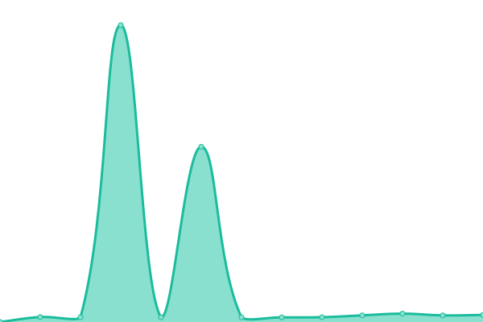
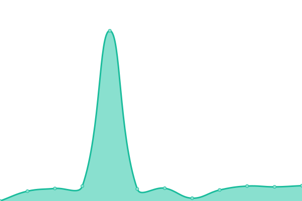
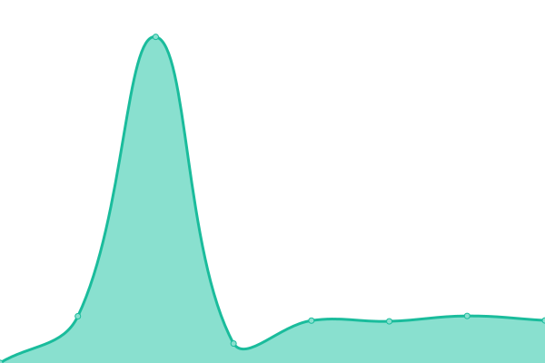
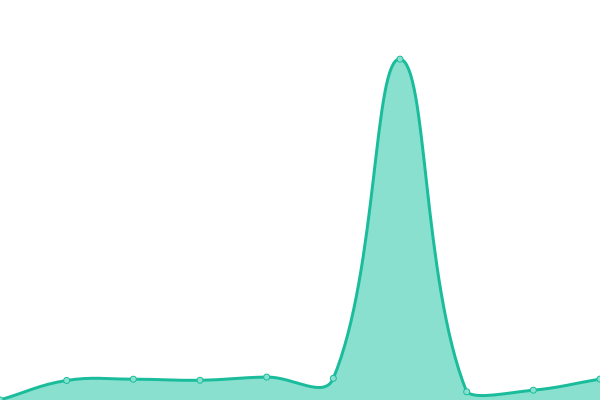

# [📈 Live Status](https://canonical.github.io/upptime): <!--live status--> **🟩 All systems operational**

This repository contains the open-source uptime monitor and status page for [Canonical web and design team](https://canonical.github.io/upptime), powered by [Upptime](https://github.com/upptime/upptime).

With [Upptime](https://upptime.js.org), you can get your own unlimited and free uptime monitor and status page, powered entirely by a GitHub repository. We use [Issues](https://github.com/canonical/upptime/issues) as incident reports, [Actions](https://github.com/canonical/upptime/actions) as uptime monitors, and [Pages](https://canonical.github.io/upptime) for the status page.

<!--start: status pages-->
<!-- This summary is generated by Upptime (https://github.com/upptime/upptime) -->
<!-- Do not edit this manually, your changes will be overwritten -->
<!-- prettier-ignore -->
| URL | Status | History | Response Time | Uptime |
| --- | ------ | ------- | ------------- | ------ |
|  [Ubuntu.com](https://ubuntu.com) | 🟩 Up | [ubuntu-com.yml](https://github.com/canonical/upptime/commits/HEAD/history/ubuntu-com.yml) | 

 1905ms
     
 | 

<a href="https://canonical.github.io/upptime/history/ubuntu-com">100.00%</a>
    

|  [Ubuntu.com engage index](https://ubuntu.com/engage) | 🟩 Up | [ubuntu-com-engage-index.yml](https://github.com/canonical/upptime/commits/HEAD/history/ubuntu-com-engage-index.yml) | 

 1379ms
     
 | 

<a href="https://canonical.github.io/upptime/history/ubuntu-com-engage-index">100.00%</a>
    

|  [Ubuntu.com takeovers index](https://ubuntu.com/takeovers) | 🟩 Up | [ubuntu-com-takeovers-index.yml](https://github.com/canonical/upptime/commits/HEAD/history/ubuntu-com-takeovers-index.yml) | 

 1382ms
     
 | 

<a href="https://canonical.github.io/upptime/history/ubuntu-com-takeovers-index">100.00%</a>
    

|  [Ubuntu.com blog](https://ubuntu.com/blog) | 🟩 Up | [ubuntu-com-blog.yml](https://github.com/canonical/upptime/commits/HEAD/history/ubuntu-com-blog.yml) | 

 1650ms
     
 | 

<a href="https://canonical.github.io/upptime/history/ubuntu-com-blog">100.00%</a>
    

|  [Ubuntu.com blog post](https://ubuntu.com/blog/design-and-web-team-summary-29-december-2020) | 🟩 Up | [ubuntu-com-blog-post.yml](https://github.com/canonical/upptime/commits/HEAD/history/ubuntu-com-blog-post.yml) | 

 1243ms
     
 | 

<a href="https://canonical.github.io/upptime/history/ubuntu-com-blog-post">100.00%</a>
    

|  [Ubuntu.com advantage](https://ubuntu.com/advantage) | 🟩 Up | [ubuntu-com-advantage.yml](https://github.com/canonical/upptime/commits/HEAD/history/ubuntu-com-advantage.yml) | 

 1652ms
     
 | 

<a href="https://canonical.github.io/upptime/history/ubuntu-com-advantage">100.00%</a>
    

|  [Ubuntu.com tutorials](https://ubuntu.com/tutorials) | 🟩 Up | [ubuntu-com-tutorials.yml](https://github.com/canonical/upptime/commits/HEAD/history/ubuntu-com-tutorials.yml) | 

 1133ms
     
 | 

<a href="https://canonical.github.io/upptime/history/ubuntu-com-tutorials">100.00%</a>
    

|  [Ubuntu.com tutorial](https://ubuntu.com/tutorials/how-to-install-ubuntu-desktop-on-raspberry-pi-4#1-overview) | 🟩 Up | [ubuntu-com-tutorial.yml](https://github.com/canonical/upptime/commits/HEAD/history/ubuntu-com-tutorial.yml) | 

 1850ms
     
 | 

<a href="https://canonical.github.io/upptime/history/ubuntu-com-tutorial">100.00%</a>
    

|  [Ubuntu.com server docs](https://ubuntu.com/server/docs) | 🟩 Up | [ubuntu-com-server-docs.yml](https://github.com/canonical/upptime/commits/HEAD/history/ubuntu-com-server-docs.yml) | 

 1736ms
     
 | 

<a href="https://canonical.github.io/upptime/history/ubuntu-com-server-docs">100.00%</a>
    

|  [Ubuntu.com kubernetes docs](https://ubuntu.com/kubernetes/docs) | 🟩 Up | [ubuntu-com-kubernetes-docs.yml](https://github.com/canonical/upptime/commits/HEAD/history/ubuntu-com-kubernetes-docs.yml) | 

 1502ms
     
 | 

<a href="https://canonical.github.io/upptime/history/ubuntu-com-kubernetes-docs">100.00%</a>
    

|  [Ubuntu.com Ceph docs](https://ubuntu.com/ceph/docs) | 🟩 Up | [ubuntu-com-ceph-docs.yml](https://github.com/canonical/upptime/commits/HEAD/history/ubuntu-com-ceph-docs.yml) | 

 1017ms
     
 | 

<a href="https://canonical.github.io/upptime/history/ubuntu-com-ceph-docs">100.00%</a>
    

|  [Ubuntu.com smart start guide](https://ubuntu.com/smartstart/guide) | 🟩 Up | [ubuntu-com-smart-start-guide.yml](https://github.com/canonical/upptime/commits/HEAD/history/ubuntu-com-smart-start-guide.yml) | 

 1298ms
     
 | 

<a href="https://canonical.github.io/upptime/history/ubuntu-com-smart-start-guide">100.00%</a>
    

|  [Ubuntu.com appliances portfolio](https://ubuntu.com/appliance/portfolio) | 🟩 Up | [ubuntu-com-appliances-portfolio.yml](https://github.com/canonical/upptime/commits/HEAD/history/ubuntu-com-appliances-portfolio.yml) | 

 998ms
     
 | 

<a href="https://canonical.github.io/upptime/history/ubuntu-com-appliances-portfolio">100.00%</a>
    

|  [Ubuntu.com appliance page](https://ubuntu.com/appliance/openhab) | 🟩 Up | [ubuntu-com-appliance-page.yml](https://github.com/canonical/upptime/commits/HEAD/history/ubuntu-com-appliance-page.yml) | 

 1310ms
     
 | 

<a href="https://canonical.github.io/upptime/history/ubuntu-com-appliance-page">77.83%</a>
    

|  [Ubuntu.com CVE list](https://ubuntu.com/security/cve) | 🟩 Up | [ubuntu-com-cve-list.yml](https://github.com/canonical/upptime/commits/HEAD/history/ubuntu-com-cve-list.yml) | 

 1737ms
     
 | 

<a href="https://canonical.github.io/upptime/history/ubuntu-com-cve-list">100.00%</a>
    

|  [Ubuntu.com CVE page](https://ubuntu.com/security/CVE-2020-15180) | 🟩 Up | [ubuntu-com-cve-page.yml](https://github.com/canonical/upptime/commits/HEAD/history/ubuntu-com-cve-page.yml) | 

 980ms
     
 | 

<a href="https://canonical.github.io/upptime/history/ubuntu-com-cve-page">100.00%</a>
    

|  [Ubuntu.com USN list](https://ubuntu.com/security/notices) | 🟩 Up | [ubuntu-com-usn-list.yml](https://github.com/canonical/upptime/commits/HEAD/history/ubuntu-com-usn-list.yml) | 

 934ms
     
 | 

<a href="https://canonical.github.io/upptime/history/ubuntu-com-usn-list">100.00%</a>
    

|  [Ubuntu.com USN page](https://ubuntu.com/security/notices/USN-4697-2) | 🟩 Up | [ubuntu-com-usn-page.yml](https://github.com/canonical/upptime/commits/HEAD/history/ubuntu-com-usn-page.yml) | 

 1432ms
     
 | 

<a href="https://canonical.github.io/upptime/history/ubuntu-com-usn-page">100.00%</a>
    

|  [Ubuntu Security API - CVEs](https://ubuntu.com/security/cves.json) | 🟩 Up | [ubuntu-security-api-cv-es.yml](https://github.com/canonical/upptime/commits/HEAD/history/ubuntu-security-api-cv-es.yml) | 

 1744ms
     
 | 

<a href="https://canonical.github.io/upptime/history/ubuntu-security-api-cv-es">100.00%</a>
    

|  [Ubuntu Security API - Notices](https://ubuntu.com/security/notices.json) | 🟩 Up | [ubuntu-security-api-notices.yml](https://github.com/canonical/upptime/commits/HEAD/history/ubuntu-security-api-notices.yml) | 

 2510ms
     
 | 

<a href="https://canonical.github.io/upptime/history/ubuntu-security-api-notices">100.00%</a>
    

|  [Ubuntu Security API - CVE page](https://ubuntu.com/security/cves/CVE-2020-15180.json) | 🟩 Up | [ubuntu-security-api-cve-page.yml](https://github.com/canonical/upptime/commits/HEAD/history/ubuntu-security-api-cve-page.yml) | 

 1241ms
     
 | 

<a href="https://canonical.github.io/upptime/history/ubuntu-security-api-cve-page">100.00%</a>
    

|  [Ubuntu Security API - USN page](https://ubuntu.com/security/notices/USN-4697-2.json) | 🟩 Up | [ubuntu-security-api-usn-page.yml](https://github.com/canonical/upptime/commits/HEAD/history/ubuntu-security-api-usn-page.yml) | 

 1313ms
     
 | 

<a href="https://canonical.github.io/upptime/history/ubuntu-security-api-usn-page">100.00%</a>
    

|  [Snapcraft.io](https://snapcraft.io) | 🟩 Up | [snapcraft-io.yml](https://github.com/canonical/upptime/commits/HEAD/history/snapcraft-io.yml) | 

 754ms
     
 | 

<a href="https://canonical.github.io/upptime/history/snapcraft-io">100.00%</a>
    

|  [Snapcraft.io store page](https://snapcraft.io/store) | 🟩 Up | [snapcraft-io-store-page.yml](https://github.com/canonical/upptime/commits/HEAD/history/snapcraft-io-store-page.yml) | 

 264ms
     
 | 

<a href="https://canonical.github.io/upptime/history/snapcraft-io-store-page">100.00%</a>
    

|  [Charmhub.io](https://charmhub.io) | 🟩 Up | [charmhub-io.yml](https://github.com/canonical/upptime/commits/HEAD/history/charmhub-io.yml) | 

 614ms
     
 | 

<a href="https://canonical.github.io/upptime/history/charmhub-io">100.00%</a>
    

|  [Vanilla Framework](https://vanillaframework.io) | 🟩 Up | [vanilla-framework.yml](https://github.com/canonical/upptime/commits/HEAD/history/vanilla-framework.yml) | 

 696ms
     
 | 

<a href="https://canonical.github.io/upptime/history/vanilla-framework">100.00%</a>
    

|  [JAAS.ai](https://jaas.ai) | 🟩 Up | [jaas-ai.yml](https://github.com/canonical/upptime/commits/HEAD/history/jaas-ai.yml) | 

 769ms
     
 | 

<a href="https://canonical.github.io/upptime/history/jaas-ai">100.00%</a>
    

|  [JAAS Dashboard](https://jaas.ai/models) | 🟩 Up | [jaas-dashboard.yml](https://github.com/canonical/upptime/commits/HEAD/history/jaas-dashboard.yml) | 

 139ms
     
 | 

<a href="https://canonical.github.io/upptime/history/jaas-dashboard">100.00%</a>
    

|  [anbox-cloud.io](https://anbox-cloud.io) | 🟩 Up | [anbox-cloud-io.yml](https://github.com/canonical/upptime/commits/HEAD/history/anbox-cloud-io.yml) | 

 713ms
     
 | 

<a href="https://canonical.github.io/upptime/history/anbox-cloud-io">100.00%</a>
    

|  [canonical.com](https://canonical.com) | 🟩 Up | [canonical-com.yml](https://github.com/canonical/upptime/commits/HEAD/history/canonical-com.yml) | 

 757ms
     
 | 

<a href="https://canonical.github.io/upptime/history/canonical-com">100.00%</a>
    

|  [certification.ubuntu.com](https://certification.ubuntu.com) | 🟩 Up | [certification-ubuntu-com.yml](https://github.com/canonical/upptime/commits/HEAD/history/certification-ubuntu-com.yml) | 

 1820ms
     
 | 

<a href="https://canonical.github.io/upptime/history/certification-ubuntu-com">100.00%</a>
    

|  [charmed-osm.com](https://charmed-osm.com) | 🟩 Up | [charmed-osm-com.yml](https://github.com/canonical/upptime/commits/HEAD/history/charmed-osm-com.yml) | 

 820ms
     
 | 

<a href="https://canonical.github.io/upptime/history/charmed-osm-com">100.00%</a>
    

|  [cn.ubuntu.com](https://cn.ubuntu.com) | 🟩 Up | [cn-ubuntu-com.yml](https://github.com/canonical/upptime/commits/HEAD/history/cn-ubuntu-com.yml) | 

 751ms
     
 | 

<a href="https://canonical.github.io/upptime/history/cn-ubuntu-com">0.00%</a>
    

|  [dqlite.io](https://dqlite.io) | 🟩 Up | [dqlite-io.yml](https://github.com/canonical/upptime/commits/HEAD/history/dqlite-io.yml) | 

 605ms
     
 | 

<a href="https://canonical.github.io/upptime/history/dqlite-io">100.00%</a>
    

|  [jp.ubuntu.com](https://jp.ubuntu.com) | 🟩 Up | [jp-ubuntu-com.yml](https://github.com/canonical/upptime/commits/HEAD/history/jp-ubuntu-com.yml) | 

 655ms
     
 | 

<a href="https://canonical.github.io/upptime/history/jp-ubuntu-com">100.00%</a>
    

|  [juju.is](https://juju.is) | 🟩 Up | [juju-is.yml](https://github.com/canonical/upptime/commits/HEAD/history/juju-is.yml) | 

 909ms
     
 | 

<a href="https://canonical.github.io/upptime/history/juju-is">100.00%</a>
    

|  [kubeflow-news.com](https://kubeflow-news.com) | 🟩 Up | [kubeflow-news-com.yml](https://github.com/canonical/upptime/commits/HEAD/history/kubeflow-news-com.yml) | 

 785ms
     
 | 

<a href="https://canonical.github.io/upptime/history/kubeflow-news-com">100.00%</a>
    

|  [maas.io](https://maas.io) | 🟩 Up | [maas-io.yml](https://github.com/canonical/upptime/commits/HEAD/history/maas-io.yml) | 

 783ms
     
 | 

<a href="https://canonical.github.io/upptime/history/maas-io">100.00%</a>
    

|  [maas.io docs](https://maas.io/docs) | 🟩 Up | [maas-io-docs.yml](https://github.com/canonical/upptime/commits/HEAD/history/maas-io-docs.yml) | 

 287ms
     
 | 

<a href="https://canonical.github.io/upptime/history/maas-io-docs">100.00%</a>
    

|  [microk8s.io](https://microk8s.io) | 🟩 Up | [microk8s-io.yml](https://github.com/canonical/upptime/commits/HEAD/history/microk8s-io.yml) | 

 719ms
     
 | 

<a href="https://canonical.github.io/upptime/history/microk8s-io">100.00%</a>
    

|  [microk8s.io/docs](https://microk8s.io/docs/release-notes) | 🟩 Up | [microk8s-io-docs.yml](https://github.com/canonical/upptime/commits/HEAD/history/microk8s-io-docs.yml) | 

 383ms
     
 | 

<a href="https://canonical.github.io/upptime/history/microk8s-io-docs">100.00%</a>
    

|  [multipass.run](https://multipass.run) | 🟩 Up | [multipass-run.yml](https://github.com/canonical/upptime/commits/HEAD/history/multipass-run.yml) | 

 584ms
     
 | 

<a href="https://canonical.github.io/upptime/history/multipass-run">100.00%</a>
    

|  [mir-server.io](https://mir-server.io) | 🟩 Up | [mir-server-io.yml](https://github.com/canonical/upptime/commits/HEAD/history/mir-server-io.yml) | 

 648ms
     
 | 

<a href="https://canonical.github.io/upptime/history/mir-server-io">100.00%</a>
    

|  [microstack.run](https://microstack.run) | 🟩 Up | [microstack-run.yml](https://github.com/canonical/upptime/commits/HEAD/history/microstack-run.yml) | 

 678ms
     
 | 

<a href="https://canonical.github.io/upptime/history/microstack-run">100.00%</a>
    

|  [netplan.io](https://netplan.io) | 🟩 Up | [netplan-io.yml](https://github.com/canonical/upptime/commits/HEAD/history/netplan-io.yml) | 

 602ms
     
 | 

<a href="https://canonical.github.io/upptime/history/netplan-io">100.00%</a>
    

|  [readthedocs docs](https://docs.ubuntu.com/) | 🟩 Up | [readthedocs-docs.yml](https://github.com/canonical/upptime/commits/HEAD/history/readthedocs-docs.yml) | 

 596ms
     
 | 

<a href="https://canonical.github.io/upptime/history/readthedocs-docs">100.00%</a>
    

<!--end: status pages-->

[**Visit our status website →**](https://canonical.github.io/upptime)

## 📄 License

- Powered by: [Upptime](https://github.com/upptime/upptime)
- Code: [MIT](./LICENSE) © [Canonical web and design team](https://canonical.github.io)
- Data in the `./history` directory: [Open Database License](https://opendatacommons.org/licenses/odbl/1-0/)
