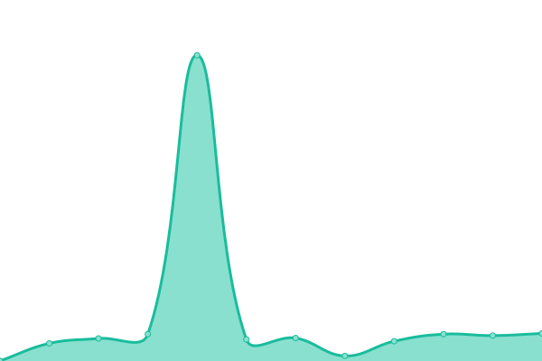
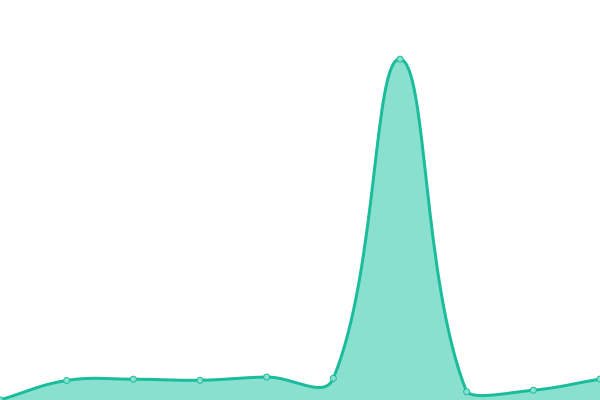

# [📈 Live Status](https://canonical.github.io/upptime): <!--live status--> **🟩 All systems operational**

This repository contains the open-source uptime monitor and status page for [Canonical web and design team](https://canonical.github.io/upptime), powered by [Upptime](https://github.com/upptime/upptime).

With [Upptime](https://upptime.js.org), you can get your own unlimited and free uptime monitor and status page, powered entirely by a GitHub repository. We use [Issues](https://github.com/canonical/upptime/issues) as incident reports, [Actions](https://github.com/canonical/upptime/actions) as uptime monitors, and [Pages](https://canonical.github.io/upptime) for the status page.

<!--start: status pages-->
<!-- This summary is generated by Upptime (https://github.com/upptime/upptime) -->
<!-- Do not edit this manually, your changes will be overwritten -->
<!-- prettier-ignore -->
| URL | Status | History | Response Time | Uptime |
| --- | ------ | ------- | ------------- | ------ |
|  [Ubuntu.com](https://ubuntu.com) | 🟩 Up | [ubuntu-com.yml](https://github.com/canonical/upptime/commits/HEAD/history/ubuntu-com.yml) | 

 954ms
     
 | 

<a href="https://canonical.github.io/upptime/history/ubuntu-com">100.00%</a>
    

|  [Ubuntu.com engage index](https://ubuntu.com/engage) | 🟩 Up | [ubuntu-com-engage-index.yml](https://github.com/canonical/upptime/commits/HEAD/history/ubuntu-com-engage-index.yml) | 

 626ms
     
 | 

<a href="https://canonical.github.io/upptime/history/ubuntu-com-engage-index">100.00%</a>
    

|  [Ubuntu.com takeovers index](https://ubuntu.com/takeovers) | 🟩 Up | [ubuntu-com-takeovers-index.yml](https://github.com/canonical/upptime/commits/HEAD/history/ubuntu-com-takeovers-index.yml) | 

 848ms
     
 | 

<a href="https://canonical.github.io/upptime/history/ubuntu-com-takeovers-index">100.00%</a>
    

|  [Ubuntu.com blog](https://ubuntu.com/blog) | 🟩 Up | [ubuntu-com-blog.yml](https://github.com/canonical/upptime/commits/HEAD/history/ubuntu-com-blog.yml) | 

 220ms
     
 | 

<a href="https://canonical.github.io/upptime/history/ubuntu-com-blog">100.00%</a>
    

|  [Ubuntu.com blog post](https://ubuntu.com/blog/design-and-web-team-summary-29-december-2020) | 🟩 Up | [ubuntu-com-blog-post.yml](https://github.com/canonical/upptime/commits/HEAD/history/ubuntu-com-blog-post.yml) | 

 461ms
     
 | 

<a href="https://canonical.github.io/upptime/history/ubuntu-com-blog-post">100.00%</a>
    

|  [Ubuntu.com advantage](https://ubuntu.com/pro) | 🟩 Up | [ubuntu-com-advantage.yml](https://github.com/canonical/upptime/commits/HEAD/history/ubuntu-com-advantage.yml) | 

 205ms
     
 | 

<a href="https://canonical.github.io/upptime/history/ubuntu-com-advantage">100.00%</a>
    

|  [Ubuntu.com tutorials](https://ubuntu.com/tutorials) | 🟩 Up | [ubuntu-com-tutorials.yml](https://github.com/canonical/upptime/commits/HEAD/history/ubuntu-com-tutorials.yml) | 

 146ms
     
 | 

<a href="https://canonical.github.io/upptime/history/ubuntu-com-tutorials">100.00%</a>
    

|  [Ubuntu.com tutorial](https://ubuntu.com/tutorials/how-to-install-ubuntu-desktop-on-raspberry-pi-4#1-overview) | 🟩 Up | [ubuntu-com-tutorial.yml](https://github.com/canonical/upptime/commits/HEAD/history/ubuntu-com-tutorial.yml) | 

 614ms
     
 | 

<a href="https://canonical.github.io/upptime/history/ubuntu-com-tutorial">100.00%</a>
    

|  [Ubuntu.com kubernetes docs](https://ubuntu.com/kubernetes/charmed-k8s/docs) | 🟩 Up | [ubuntu-com-kubernetes-docs.yml](https://github.com/canonical/upptime/commits/HEAD/history/ubuntu-com-kubernetes-docs.yml) | 

 183ms
     
 | 

<a href="https://canonical.github.io/upptime/history/ubuntu-com-kubernetes-docs">100.00%</a>
    

|  [Ubuntu.com Ceph docs](https://ubuntu.com/ceph/docs) | 🟩 Up | [ubuntu-com-ceph-docs.yml](https://github.com/canonical/upptime/commits/HEAD/history/ubuntu-com-ceph-docs.yml) | 

 282ms
     
 | 

<a href="https://canonical.github.io/upptime/history/ubuntu-com-ceph-docs">100.00%</a>
    

|  [Ubuntu Server docs](https://documentation.ubuntu.com/server/) | 🟩 Up | [ubuntu-server-docs.yml](https://github.com/canonical/upptime/commits/HEAD/history/ubuntu-server-docs.yml) | 

 626ms
     
 | 

<a href="https://canonical.github.io/upptime/history/ubuntu-server-docs">99.69%</a>
    

|  [Ubuntu.com appliance landing page](https://ubuntu.com/appliance) | 🟩 Up | [ubuntu-com-appliance-landing-page.yml](https://github.com/canonical/upptime/commits/HEAD/history/ubuntu-com-appliance-landing-page.yml) | 

 160ms
     
 | 

<a href="https://canonical.github.io/upptime/history/ubuntu-com-appliance-landing-page">100.00%</a>
    

|  [Ubuntu.com appliance openhab page](https://ubuntu.com/appliance/openhab) | 🟩 Up | [ubuntu-com-appliance-openhab-page.yml](https://github.com/canonical/upptime/commits/HEAD/history/ubuntu-com-appliance-openhab-page.yml) | 

 169ms
     
 | 

<a href="https://canonical.github.io/upptime/history/ubuntu-com-appliance-openhab-page">100.00%</a>
    

|  [Ubuntu.com CVE list](https://ubuntu.com/security/cves) | 🟩 Up | [ubuntu-com-cve-list.yml](https://github.com/canonical/upptime/commits/HEAD/history/ubuntu-com-cve-list.yml) | 

 155ms
     
 | 

<a href="https://canonical.github.io/upptime/history/ubuntu-com-cve-list">100.00%</a>
    

|  [Ubuntu.com CVE page](https://ubuntu.com/security/CVE-2020-15180) | 🟩 Up | [ubuntu-com-cve-page.yml](https://github.com/canonical/upptime/commits/HEAD/history/ubuntu-com-cve-page.yml) | 

 194ms
     
 | 

<a href="https://canonical.github.io/upptime/history/ubuntu-com-cve-page">100.00%</a>
    

|  [Ubuntu.com USN list](https://ubuntu.com/security/notices) | 🟩 Up | [ubuntu-com-usn-list.yml](https://github.com/canonical/upptime/commits/HEAD/history/ubuntu-com-usn-list.yml) | 

 156ms
     
 | 

<a href="https://canonical.github.io/upptime/history/ubuntu-com-usn-list">100.00%</a>
    

|  [Ubuntu.com USN page](https://ubuntu.com/security/notices/USN-4697-2) | 🟩 Up | [ubuntu-com-usn-page.yml](https://github.com/canonical/upptime/commits/HEAD/history/ubuntu-com-usn-page.yml) | 

 150ms
     
 | 

<a href="https://canonical.github.io/upptime/history/ubuntu-com-usn-page">100.00%</a>
    

|  [Ubuntu Security API - CVEs](https://ubuntu.com/security/cves.json) | 🟩 Up | [ubuntu-security-api-cv-es.yml](https://github.com/canonical/upptime/commits/HEAD/history/ubuntu-security-api-cv-es.yml) | 

 3087ms
     
 | 

<a href="https://canonical.github.io/upptime/history/ubuntu-security-api-cv-es">98.81%</a>
    

|  [Ubuntu Security API - Notices](https://ubuntu.com/security/notices.json) | 🟩 Up | [ubuntu-security-api-notices.yml](https://github.com/canonical/upptime/commits/HEAD/history/ubuntu-security-api-notices.yml) | 

 5031ms
     
 | 

<a href="https://canonical.github.io/upptime/history/ubuntu-security-api-notices">87.75%</a>
    

|  [Ubuntu Security API - CVE page](https://ubuntu.com/security/cves/CVE-2020-15180.json) | 🟩 Up | [ubuntu-security-api-cve-page.yml](https://github.com/canonical/upptime/commits/HEAD/history/ubuntu-security-api-cve-page.yml) | 

 1103ms
     
 | 

<a href="https://canonical.github.io/upptime/history/ubuntu-security-api-cve-page">98.83%</a>
    

|  [Ubuntu Security API - USN page](https://ubuntu.com/security/notices/USN-4697-2.json) | 🟩 Up | [ubuntu-security-api-usn-page.yml](https://github.com/canonical/upptime/commits/HEAD/history/ubuntu-security-api-usn-page.yml) | 

 1582ms
     
 | 

<a href="https://canonical.github.io/upptime/history/ubuntu-security-api-usn-page">91.36%</a>
    

|  [Snapcraft.io](https://snapcraft.io) | 🟩 Up | [snapcraft-io.yml](https://github.com/canonical/upptime/commits/HEAD/history/snapcraft-io.yml) | 

 777ms
     
 | 

<a href="https://canonical.github.io/upptime/history/snapcraft-io">99.84%</a>
    

|  [Snapcraft.io store page](https://snapcraft.io/store) | 🟩 Up | [snapcraft-io-store-page.yml](https://github.com/canonical/upptime/commits/HEAD/history/snapcraft-io-store-page.yml) | 

 143ms
     
 | 

<a href="https://canonical.github.io/upptime/history/snapcraft-io-store-page">100.00%</a>
    

|  [Charmhub.io](https://charmhub.io) | 🟩 Up | [charmhub-io.yml](https://github.com/canonical/upptime/commits/HEAD/history/charmhub-io.yml) | 

 735ms
     
 | 

<a href="https://canonical.github.io/upptime/history/charmhub-io">99.84%</a>
    

|  [Vanilla Framework](https://vanillaframework.io) | 🟩 Up | [vanilla-framework.yml](https://github.com/canonical/upptime/commits/HEAD/history/vanilla-framework.yml) | 

 633ms
     
 | 

<a href="https://canonical.github.io/upptime/history/vanilla-framework">100.00%</a>
    

|  [JAAS.ai](https://jaas.ai) | 🟩 Up | [jaas-ai.yml](https://github.com/canonical/upptime/commits/HEAD/history/jaas-ai.yml) | 

 1534ms
     
 | 

<a href="https://canonical.github.io/upptime/history/jaas-ai">100.00%</a>
    

|  [canonical.com](https://canonical.com) | 🟩 Up | [canonical-com.yml](https://github.com/canonical/upptime/commits/HEAD/history/canonical-com.yml) | 

 320ms
     
 | 

<a href="https://canonical.github.io/upptime/history/canonical-com">100.00%</a>
    

|  [canonical.com solutions page](https://canonical.com/solutions) | 🟩 Up | [canonical-com-solutions-page.yml](https://github.com/canonical/upptime/commits/HEAD/history/canonical-com-solutions-page.yml) | 

 267ms
     
 | 

<a href="https://canonical.github.io/upptime/history/canonical-com-solutions-page">100.00%</a>
    

|  [cn.ubuntu.com](https://cn.ubuntu.com) | 🟩 Up | [cn-ubuntu-com.yml](https://github.com/canonical/upptime/commits/HEAD/history/cn-ubuntu-com.yml) | 

 760ms
     
 | 

<a href="https://canonical.github.io/upptime/history/cn-ubuntu-com">100.00%</a>
    

|  [jp.ubuntu.com](https://jp.ubuntu.com) | 🟩 Up | [jp-ubuntu-com.yml](https://github.com/canonical/upptime/commits/HEAD/history/jp-ubuntu-com.yml) | 

 799ms
     
 | 

<a href="https://canonical.github.io/upptime/history/jp-ubuntu-com">100.00%</a>
    

|  [juju.is](https://juju.is) | 🟩 Up | [juju-is.yml](https://github.com/canonical/upptime/commits/HEAD/history/juju-is.yml) | 

 1337ms
     
 | 

<a href="https://canonical.github.io/upptime/history/juju-is">100.00%</a>
    

|  [microk8s.io](https://microk8s.io) | 🟩 Up | [microk8s-io.yml](https://github.com/canonical/upptime/commits/HEAD/history/microk8s-io.yml) | 

 1402ms
     
 | 

<a href="https://canonical.github.io/upptime/history/microk8s-io">100.00%</a>
    

|  [microk8s.io/docs](https://microk8s.io/docs/release-notes) | 🟩 Up | [microk8s-io-docs.yml](https://github.com/canonical/upptime/commits/HEAD/history/microk8s-io-docs.yml) | 

 548ms
     
 | 

<a href="https://canonical.github.io/upptime/history/microk8s-io-docs">100.00%</a>
    

|  [netplan.io](https://netplan.io) | 🟩 Up | [netplan-io.yml](https://github.com/canonical/upptime/commits/HEAD/history/netplan-io.yml) | 

 639ms
     
 | 

<a href="https://canonical.github.io/upptime/history/netplan-io">100.00%</a>
    

|  [readthedocs index page](https://docs.ubuntu.com/) | 🟩 Up | [readthedocs-index-page.yml](https://github.com/canonical/upptime/commits/HEAD/history/readthedocs-index-page.yml) | 

 637ms
     
 | 

<a href="https://canonical.github.io/upptime/history/readthedocs-index-page">100.00%</a>
    

|  [Content System](https://cs.canonical.com) | 🟩 Up | [content-system.yml](https://github.com/canonical/upptime/commits/HEAD/history/content-system.yml) | 

 633ms
     
 | 

<a href="https://canonical.github.io/upptime/history/content-system">100.00%</a>
    

|  [Canonical Design](https://canonical.design) | 🟩 Up | [canonical-design.yml](https://github.com/canonical/upptime/commits/HEAD/history/canonical-design.yml) | 

 795ms
     
 | 

<a href="https://canonical.github.io/upptime/history/canonical-design">100.00%</a>
    

<!--end: status pages-->

[**Visit our status website →**](https://canonical.github.io/upptime)

## 📄 License

- Powered by: [Upptime](https://github.com/upptime/upptime)
- Code: [MIT](./LICENSE) © [Canonical web and design team](https://canonical.github.io)
- Data in the `./history` directory: [Open Database License](https://opendatacommons.org/licenses/odbl/1-0/)
